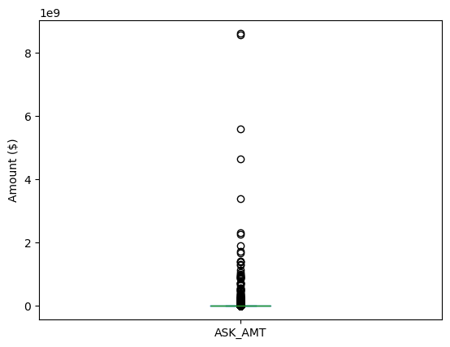

# deep-learning-challenge
Bootcamp Module 12 homework on deep-learning

## Overview of the analysis: 
The nonprofit foundation Alphabet Soup wants a tool that can help it select the applicants for funding with the best chance of success in their ventures. 

The objective of this project is to create a binary classifier that can predict whether applicants will be successful if funded by Alphabet Soup.

## Data Locations

#### Notebooks
An exploratory data notebook [initial_model.ipynb](initial_model.ipynb) provides the initial data pre-processing and a simple 2-layer deep-neural network. Additional pre-processing techniques and hyper-parameter tuning are recorded in [AlphabetSoupCharity_Optimisation.ipynb](AlphabetSoupCharity_Optimisation.ipynb).

#### Checkpoints
Model weight checkpoints are located in [checkpoints/](./checkpoints/).

#### Models
Initial and final trained models are located in [models/](./models/).

# Results

## Data Preprocessing
### Features in the model
From Alphabet Soup’s business team, you have received a CSV containing more than 34,000 organisations that have received funding from Alphabet Soup over the years. Within this dataset are a number of columns that capture metadata about each organisation, such as:

- EIN and NAME: Identification columns
- APPLICATION_TYPE: Alphabet Soup application type
- AFFILIATION: Affiliated sector of industry
- CLASSIFICATION: Government organisation classification
- USE_CASE: Use case for funding
- ORGANIZATION: Organisation type
- STATUS: Active status
- INCOME_AMT: Income classification
- SPECIAL_CONSIDERATIONS: Special considerations for application
- ASK_AMT: Funding amount requested
- IS_SUCCESSFUL: Was the money used effectively

### Target Variable
The target variable in this dataset is the binary column IS_SUCCESSFUL. The dataset provide has a nearly 50-50 split between successful donations

```
IS_SUCCESSFUL
1    18261
0    16038
Name: count, dtype: int64
```


### What features were removed?
#### Initial model
In the [initial_model.ipynb](initial_model.ipynb), the identification layers EIN and NAME were removed as they practically do not offer any predictive value. 

Additionally due the large number unique values in the APPLICATIION_TYPES and CLASSIFICATIONS columns, these were binned to reduce the number of individual unique values.
- For the APPLICATION_TYPES column, if there was a total count of any value less than 500 this was pooled into 'Other'
- For the CLASSIFICATIONS column, if there was a total count of any value less than 1000 this was pooled into 'Other'


#### Optimising the model
In the optimisation phase of the project the STATUS column was also dropped due to the rare occurrences of status 0.
```
STATUS
1    34294
0        5
Name: count, dtype: int64
```
The APPLICATIION_TYPES and CLASSIFICATIONS columns were again binned, but less stringently to provide some additional detail in the predictions. 
- For the APPLICATION_TYPES column, if there was a total count of any value less than 50 this was pooled into 'Other'
- For the CLASSIFICATIONS column, if there was a total count of any value less than 10 this was pooled into 'Other'

##### The ASK_AMT column
It was also noted that the ASK_AMT column contains values which are heavily skewed right as shown in the boxplot below.



After reading about some [different ways to handle skewed right datasets](https://machinelearningmastery.com/skewness-be-gone-transformative-tricks-for-data-scientists/), I decided to use Yeo-Jonhson Transformation which is implemented in the scikit-learn preprocessing library.


## Compiling Training and Evaluating the Model

### Initial Model
The initial model is a simple 2 layer neural network. The first layer is simply the number of data points in the training set.
```
Model: "initial_model"
_________________________________________________________________
 Layer (type)                Output Shape              Param #   
=================================================================
 Layer_1 (Dense)             (None, 86)                3784      
                                                                 
 Layer_2 (Dense)             (None, 129)               11223     
                                                                 
 Output (Dense)              (None, 1)                 130       
                                                                 
=================================================================
Total params: 15137 (59.13 KB)
Trainable params: 15137 (59.13 KB)
Non-trainable params: 0 (0.00 Byte)
_________________________________________________________________
```
This model used 86 neurons in the first layer and 129 neurons in the second layer. The reason for these seemingly random numbers is that there is a 'rule-of-thumb' (suggested in class notes) which is - hidden layers should have 2-3 times the number of input features. In this case the number of features in the training dataset is 43.

This model was trained using 30 epochs and achieved a validation score as follows:

```
Loss: 0.5545585751533508, Accuracy: 0.7253644466400146
```


### Optimising the Model
As mentioned in the pre-processing section, there were steps taken to improve and optimise the pre-processing step. Using the same layer parameters as the "initial_model" as a base case, the following loss and accuracy attributes verify the improvement in predictions:

```
Loss: 0.5523973107337952, Accuracy: 0.7328279614448547
```

In an attempt to improve model performance, I used Keras-Tuner to help iterate through different hyperparameter values including:
- Adding a dropout layer with 30% dropout for the input to help add stability to model predictions
- Different activation functions: 'relu' and 'tanh' for the different hidden layers
- Different number of hidden layers ranging from 2 to 5.
- Different number of neurons per layer ranging from 140 to 350 which corresponds to 2-5 x the rounded number of input features. (i.e. number of input features is 66 for the training set therefore 2x70 to 5x70 corresponds to 140 to 350)
- Increase the number of epochs to 50 from 30.

The following summarises the top 5 hyperparmeters for the top 5 models (sorted by best first):
```
{'activation': 'tanh', 'first_units': 210, 'num_layers': 3, 'units_0': 280, 'units_1': 230, 'units_2': 180, 'units_3': 350, 'tuner/epochs': 50, 'tuner/initial_epoch': 0, 'tuner/bracket': 0, 'tuner/round': 0}
{'activation': 'relu', 'first_units': 160, 'num_layers': 2, 'units_0': 200, 'units_1': 230, 'units_2': 150, 'units_3': 230, 'tuner/epochs': 50, 'tuner/initial_epoch': 17, 'tuner/bracket': 2, 'tuner/round': 2, 'tuner/trial_id': '0070'}
{'activation': 'relu', 'first_units': 230, 'num_layers': 2, 'units_0': 310, 'units_1': 250, 'units_2': 300, 'units_3': 340, 'tuner/epochs': 17, 'tuner/initial_epoch': 0, 'tuner/bracket': 1, 'tuner/round': 0}
{'activation': 'tanh', 'first_units': 350, 'num_layers': 4, 'units_0': 220, 'units_1': 240, 'units_2': 340, 'units_3': 280, 'tuner/epochs': 50, 'tuner/initial_epoch': 17, 'tuner/bracket': 3, 'tuner/round': 3, 'tuner/trial_id': '0137'}
{'activation': 'tanh', 'first_units': 270, 'num_layers': 1, 'units_0': 290, 'units_1': 160, 'units_2': 300, 'units_3': 170, 'tuner/epochs': 6, 'tuner/initial_epoch': 0, 'tuner/bracket': 2, 'tuner/round': 0}

```

For example the top model has a structure of:
```
Model: "sequential"
_________________________________________________________________
 Layer (type)                Output Shape              Param #   
=================================================================
 dropout (Dropout)           (None, 66)                0         
                                                                 
 Layer_1 (Dense)             (None, 210)               14070     
                                                                 
 Layer_2 (Dense)             (None, 280)               59080     
                                                                 
 Layer_3 (Dense)             (None, 230)               64630     
                                                                 
 Layer_4 (Dense)             (None, 180)               41580     
                                                                 
 Output (Dense)              (None, 1)                 181       
                                                                 
=================================================================
Total params: 179541 (701.33 KB)
Trainable params: 179541 (701.33 KB)
Non-trainable params: 0 (0.00 Byte)
_________________________________________________________________
None

```

## Model Results 

The following results document the validated loss and prediction attributes the top 5 models on the test data.
```
model 1 Loss: 0.5511918663978577, Accuracy: 0.7331778407096863

model 2 Loss: 0.5487939119338989, Accuracy: 0.7328279614448547

model 3 Loss: 0.5521612167358398, Accuracy: 0.7328279614448547

model 4 Loss: 0.5524091124534607, Accuracy: 0.7328279614448547

model 5 Loss: 0.5549689531326294, Accuracy: 0.7328279614448547

```


## Summary
As shown in the previous results, after some effort, I was not able to achieve a validated accuracy on the target of 75%.
Disappointingly, there is only very minimal improvement using the deeper neural networks and optimisation steps described above compared to the initial model. 

Other types of classification techniques could be used to solve this binary problem such as dimensionality reduction techniques  followed by supervised classification techniques.
Some dimensionality reduction techniques could include:
- PCA
- t-SNE
  
Some supervised learning classification techniques include:
- SVMs
- KNN
- Random-Forest

These techniques should work as they are all classification techniques for supervised machine learning problems because this project is essentially a binary classification model.


